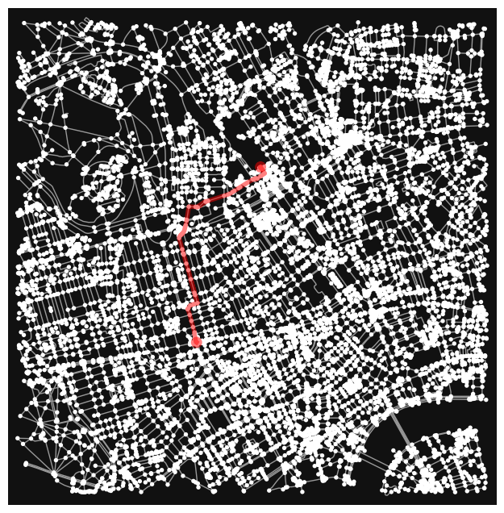

# Bloomsbury Network Analysis

## Introduction

This study aims to conduct a street network analysis of cafes near UCL Bloomsbury within a radius of 2000 metres. By calculating the closeness and betweenness centrality, a visual interpretation is then performed to review the relationship between the distribution of cafes and networks, whether they are aligned or not. Additionally, the shortest path is demonstrated from Oxford Circus to Euston Station, reviewing how many cafes exist along the generated route.

## Dataset and Neighbourhood

The dataset is derived from OSM using OSMnx towards the walk route. The study area is a learning environment, assuming people walk from campus to nearby places, such as cafes or stations. UCL Bloomsbury is chosen as the starting point, being located near several stations.

## Analysis and Visualisation

### Import Libraries


```python
# import libraries
import numpy as np
import pandas as pd
import matplotlib
import matplotlib.pyplot as plt
import osmnx as ox        # this line imports osmnx
import networkx as nx     # this line imports networkx
import matplotlib.cm as cm
import matplotlib.colors as colors
import contextily as ctx
```

### Defining study area


```python
# defining networks of UCL with radius of 2000 metres
G=ox.graph_from_address('UCL, London', dist=2000, network_type='walk')
#ox.plot_graph(G)
```

### Get Cafe Geometries


```python
# Define the tags for filtering amenities (in this case, cafes)
tags = {'amenity': 'cafe'}

cafe_geom = ox.features.features_from_address('UCL, London', tags=tags, dist=2000)
cafe_geom = cafe_geom.to_crs(epsg=3857)
```


```python
# Plot the cafes
fig, ax = plt.subplots(figsize=(8, 8))
cafe_geom.plot(ax=ax, color='blue', markersize=20, alpha=0.7, label='Cafes')

# Add basemap from CartoDB.Positron
ctx.add_basemap(ax, source=ctx.providers.CartoDB.Positron)

ax.axis('off')
plt.legend()
plt.show()
```

    C:\Users\fajrunwm\AppData\Local\Temp\ipykernel_31008\563875412.py:9: UserWarning: Legend does not support handles for PatchCollection instances.
    See: https://matplotlib.org/stable/tutorials/intermediate/legend_guide.html#implementing-a-custom-legend-handler
      plt.legend()
    


    

    


### Network Analysis

#### Closeness Centrality


```python
# some of the centrality measures are not implemented on multiGraph so first set as diGraph
DG = ox.get_digraph(G)
```


```python
# calculate its edge closeness centrality: convert graph into a line graph so edges become nodes and vice versa
edge_cc = nx.closeness_centrality(nx.line_graph(DG))

# after this it need to first set the attributes back to its edge
nx.set_edge_attributes(DG, edge_cc,'cc')

# and turn back to multiGraph for plotting
G = nx.MultiGraph(DG)

# convert graph to geopandas dataframe
gdf_edges = ox.graph_to_gdfs(G,nodes=False,fill_edge_geometry=True)

# set crs to 3857 (needed for contextily)
gdf_edges = gdf_edges.to_crs(epsg=3857) # setting crs to 3857

# Plot the cafes and edges
fig, ax = plt.subplots(figsize=(8, 8))

# Plot the cafe geometries
cafe_geom.plot(ax=ax, color='red', markersize=20, label='Cafes')

# Plot the edges according to closeness centrality
gdf_edges.plot(ax=ax, column='cc', cmap='plasma', label='edges', linewidth=1, legend=True, legend_kwds={'shrink': 0.8})

# Add basemap from CartoDB.Positron
ctx.add_basemap(ax, source=ctx.providers.CartoDB.Positron)

ax.axis('off')
plt.title('Map of cafe with closeness centrality index')
plt.legend()
plt.show()
```

    C:\Users\fajrunwm\AppData\Local\Temp\ipykernel_31008\1196762778.py:30: UserWarning: Legend does not support handles for PatchCollection instances.
    See: https://matplotlib.org/stable/tutorials/intermediate/legend_guide.html#implementing-a-custom-legend-handler
      plt.legend()
    


    

    


#### Betweenness Centrality


```python
# similarly, let's calculate edge betweenness centrality: convert graph to a line graph so edges become nodes and vice versa
edge_bc = nx.betweenness_centrality(nx.line_graph(DG))

# after this it need to first set the attributes back to its edge
nx.set_edge_attributes(DG,edge_bc,'bc')

# and turn back to multiGraph for plotting
G = nx.MultiGraph(DG)

# convert graph to geopandas dataframe
gdf_edges = ox.graph_to_gdfs(G,nodes=False,fill_edge_geometry=True)

# set crs to 3857 (needed for contextily)
gdf_edges = gdf_edges.to_crs(epsg=3857) # setting crs to 3857

# Plot the cafes and edges
fig, ax = plt.subplots(figsize=(8, 8))

# Plot the cafe geometries
cafe_geom.plot(ax=ax, color='red', markersize=20, label='Cafes')

# Plot the edges according to betweenness centrality
gdf_edges.plot(ax=ax, column='bc', cmap='plasma', label='edges', linewidth=1, legend=True, legend_kwds={'shrink': 0.8})

# Add basemap from CartoDB.Positron
ctx.add_basemap(ax, source=ctx.providers.CartoDB.Positron)

ax.axis('off')
plt.title('Map of cafe with betweenness centrality index')
plt.legend()
plt.show()
```

    C:\Users\fajrunwm\AppData\Local\Temp\ipykernel_31008\1470670966.py:30: UserWarning: Legend does not support handles for PatchCollection instances.
    See: https://matplotlib.org/stable/tutorials/intermediate/legend_guide.html#implementing-a-custom-legend-handler
      plt.legend()
    


    

    


#### Shortest Path


```python
# shortest path
origin_point = ox.geocode('Oxford Circus, London')
destination_point = ox.geocode('Euston Station, London')

origin_node = ox.nearest_nodes(G, origin_point[1], origin_point[0])
destination_node = ox.nearest_nodes(G, destination_point[1], destination_point[0])
origin_node, destination_node

route = nx.shortest_path(G, origin_node, destination_node, weight='length')
str(route)

fig,ax = ox.plot_graph_route(G, route)
```


    

    


## Discussion

The analysis of closeness and betweenness centrality provides valuable insights into the spatial structure and connectivity within the study area. Along Cleveland Street, the highest closeness centrality score indicates excellent accessibility and connectivity to the entire edge of the study area. It suggests that the node is well-connected to various destinations and easily reachable from different parts of the neighbourhood. Despite having the highest closeness centrality, this road is not the densest location of cafes.


Meanwhile, the highest betweenness centrality lies on several separated edges, such as Wimpole Street and Berners Street, indicating that these streets play a critical role in connecting different parts of the network. However, it may experience heavy traffic and serve as a major thoroughfare, potentially requiring improvement for pedestrian enjoyment. It may have a different pattern in terms of café concentration, indicating that such streets might not be popular among coffee lovers.


The shortest path from Oxford Circus to Euston station offers the most effortless pedestrian route in terms of distance, passing several cafes along the route. However, it is technically difficult to visualise the shortest path and cafe spots on the same canvas.


